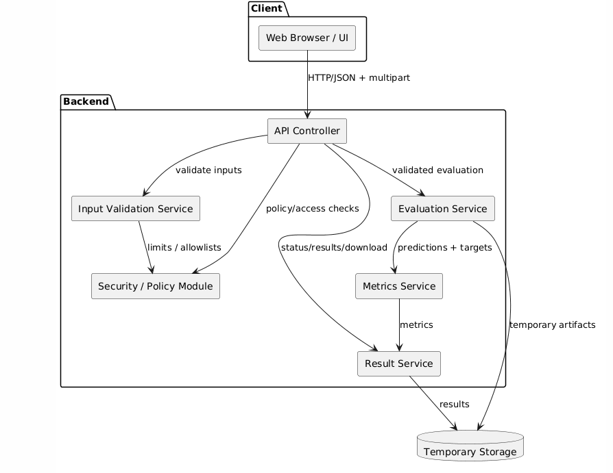
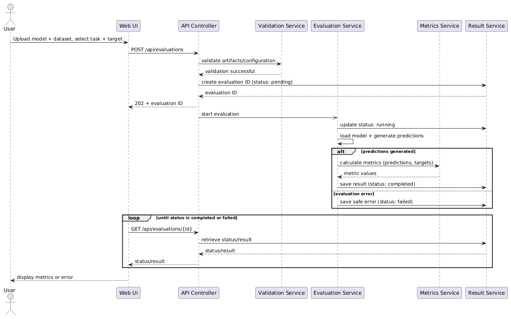
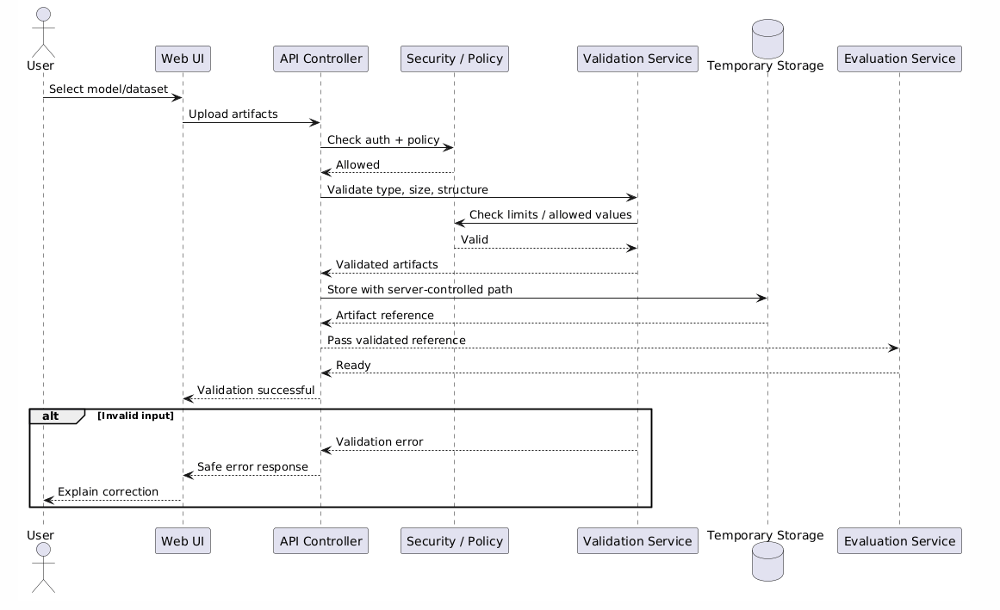

# Software Architecture & Design Specification
## Web-Based ML Model Evaluator


# Part I — Architecture Specification

## 1. Introduction

### 1.1 Purpose

This document defines the architecture and detailed design of the Web-Based ML Model Evaluator. It translates the requirements in the [SRS](01_SRS.md) into system components, interfaces, interactions, security controls, and error-handling behavior.

### 1.2 Architectural Goals

- Separate presentation, API, validation, evaluation, and result responsibilities.
- Make evaluation behavior testable independently of the UI.
- Prevent invalid input from reaching the evaluation engine.
- Keep security-sensitive operations centralized.
- Maintain traceability to SRS requirements.

---

## 2. System Architecture

The proposed architecture follows a **layered architecture with a service-oriented backend boundary**:

1. Presentation Layer
2. API/Application Layer
3. Validation Service
4. Evaluation Service
5. Metrics/Result Service
6. Temporary Storage

The browser communicates with the backend through HTTP/JSON APIs and multipart upload requests.

### 2.1 Architectural Pattern

**Primary pattern: Layered Architecture**

The layered pattern separates UI, request orchestration, validation, domain evaluation, and storage responsibilities.

**Supporting pattern: Service-oriented backend components**

Validation, evaluation, and result handling are exposed as distinct internal responsibilities behind the API boundary.

---

## 3. Component Description

| Component | Responsibility | Main Requirements |
|---|---|---|
| Web UI | Uploads, configuration, status, results, download controls | FR-01–FR-06, FR-12–FR-16, NFR-01 |
| API Gateway/Controller | Receives requests, validates request structure, routes operations | FR-03–FR-08, SEC-08 |
| Input Validation Service | File, schema, size, task, and target validation | FR-03–FR-07, FR-16, SEC-01, SEC-03, SEC-08 |
| Evaluation Service | Loads supported model, prepares input, runs prediction | FR-08, FR-12, SEC-04 |
| Metrics Service | Computes classification/regression metrics | FR-09–FR-11, NFR-03 |
| Result Service | Formats, stores, retrieves, and exports results | FR-13, FR-15, FR-18–FR-20, NFR-08 |
| Temporary Storage | Stores uploaded artifacts/results for the active lifecycle | FR-17, SEC-02, SEC-07 |
| Security/Policy Module | Centralizes limits, allowed values, and access checks | NFR-04, NFR-06, NFR-07, SEC-01–SEC-08 |

---

## 4. Component Diagram



*Source: `uml/component.png`*

The diagram shows the browser, backend/API, validation, evaluation, metrics, result, and temporary storage components.

---

## 5. Architectural Data Flow

1. Browser sends model/dataset to API.
2. API passes artifacts to validation service.
3. Validation service checks type, size, structure, and required configuration.
4. Validated inputs are assigned an evaluation identifier.
5. Evaluation service loads the supported model and generates predictions.
6. Metrics service calculates task-appropriate metrics.
7. Result service creates a structured result.
8. UI retrieves status/result and displays it.
9. User may request a structured download.
10. Temporary artifacts are removed according to retention policy.

---

## 6. Security Architecture

### 6.1 Trust Boundaries

**Boundary 1 — Browser ↔ Backend:** All user-controlled data is considered untrusted.

**Boundary 2 — Backend ↔ Evaluation Engine:** Only validated inputs may cross into model execution.

**Boundary 3 — Backend ↔ Storage:** User-controlled filenames shall not directly determine storage paths.

### 6.2 Controls

- Allowlist supported file types/formats.
- Enforce file-size limits.
- Validate CSV structure and target column.
- Validate task type server-side.
- Generate server-controlled artifact names.
- Restrict temporary storage permissions.
- Apply execution/resource limits.
- Sanitize client-facing errors.
- Apply authentication checks where configured.
- Clean up temporary artifacts.

### 6.3 Security Traceability

| Security Requirement | Architecture Element |
|---|---|
| SEC-01 | Input Validation + Security/Policy Module |
| SEC-02 | Temporary Storage |
| SEC-03 | Input Validation Service |
| SEC-04 | Evaluation Service + Security/Policy Module |
| SEC-05 | API Error Handler |
| SEC-06 | API Authentication Middleware |
| SEC-07 | Temporary Storage Lifecycle Manager |
| SEC-08 | API Controller + Input Validation |

---

## 7. Architecture-to-Requirement Traceability

| Requirement Group | Component(s) |
|---|---|
| FR-01–FR-02 | Web UI, API, Validation |
| FR-03–FR-07 | Validation Service |
| FR-08 | Evaluation Service |
| FR-09–FR-11 | Metrics Service |
| FR-12 | API, Evaluation Service, Result Service |
| FR-13–FR-15 | Web UI, Result Service |
| FR-16–FR-18 | API, Validation, Result, Storage |
| FR-19–FR-20 | API, Result Service |
| NFR-01 | Web UI |
| NFR-02–NFR-03 | API, Evaluation, Metrics |
| NFR-04–NFR-06 | Validation, Security/Policy |
| NFR-07 | Authentication Middleware |
| NFR-08 | Result Service |
| NFR-09 | Overall component separation |
| NFR-10 | Security/Policy, Validation, Evaluation |

---

# Part II — Detailed Design Specification

## 8. Sequence Diagram — Model Evaluation



*Source: `uml/sequence_evaluation.png`*

Main interaction:

**User → UI → API → Validator → Evaluation Service → Metrics Service → Result Service → UI**

The sequence covers upload/configuration validation, evaluation execution, metric calculation, result creation, and display.

---

## 9. Sequence Diagram — Upload Validation



*Source: `uml/sequence_validation.png`*

The sequence focuses on the security-sensitive path where user-controlled files are checked before they can reach model execution.

---

## 10. API Design

### 10.1 POST `/api/evaluations`

Creates an evaluation request.

**Request:** multipart/form-data

| Field | Type | Required |
|---|---|---|
| model | file | Yes |
| dataset | file | Yes |
| task_type | string | Yes |
| target_column | string | Yes |

**Success:** `202 Accepted`

Example response:

```json
{
  "evaluation_id": "eval_12345",
  "status": "pending"
}
```

### 10.2 GET `/api/evaluations/{evaluation_id}`

Returns status and, when completed, results.

Possible status values:

- `pending`
- `running`
- `completed`
- `failed`

Example completed response:

```json
{
  "evaluation_id": "eval_12345",
  "status": "completed",
  "task_type": "classification",
  "metrics": {
    "accuracy": 0.94,
    "precision": 0.93,
    "recall": 0.92,
    "f1": 0.925
  }
}
```

### 10.3 GET `/api/evaluations/{evaluation_id}/download`

Returns the completed result in a structured downloadable format.

### 10.4 Error Response

The API shall use a consistent structure:

```json
{
  "error": {
    "code": "INVALID_TARGET_COLUMN",
    "message": "The selected target column does not exist in the dataset."
  }
}
```

The response shall not expose stack traces, server filesystem paths, secrets, or other internal implementation details.

---

## 11. Error Handling

| Error | System Response |
|---|---|
| Unsupported file | Reject request with validation error |
| File too large | Reject request with size-limit error |
| Malformed CSV | Reject dataset before evaluation |
| Invalid model | Reject model before evaluation |
| Missing target column | Prevent evaluation and report target error |
| Invalid task type | Reject configuration |
| Model/dataset incompatibility | Mark evaluation failed with safe message |
| Runtime evaluation failure | Mark evaluation failed and log diagnostic internally |
| Unknown evaluation ID | Return not-found error |
| Download before completion | Return appropriate status error |

---

## 12. Design Principles

- Validate before execute.
- Keep components cohesive.
- Keep API contracts explicit.
- Do not trust client-side validation.
- Use stable requirement IDs in implementation and tests.
- Return safe, actionable errors.
- Keep metric calculations deterministic where the underlying model permits it.

---

## 13. Deployment View

A minimal deployment consists of:

**Client Browser → Web/API Server → Evaluation Runtime → Temporary Storage**

For a development deployment, the frontend and backend may run on the same host. The evaluation runtime should remain logically separated from presentation and API concerns even when deployed in a single process/container.

---

## 14. Future Extensions

The following are outside initial scope but may be considered later:

- additional model formats;
- authentication/user accounts;
- experiment history;
- dataset drift analysis;
- fairness metrics;
- explainability modules;
- comparison of multiple models.

---